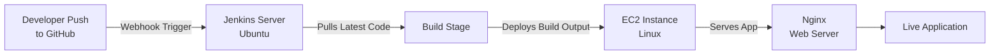

# 🎬 Netflix/Hotstar Clone — AWS CI/CD Deployment Pipeline

A hands-on DevOps project demonstrating an automated, end-to-end deployment pipeline: from a `git push` to a live, publicly accessible application running on AWS — with zero manual deployment steps.

> **Note:** The application code itself is a pre-built open-source clone, used as the deployment target. The focus of this project is the **infrastructure, automation, and CI/CD pipeline**, not the frontend application code.

---

## 🗺️ Deployment Roadmap

**Flow:** Code push → GitHub webhook fires → Jenkins pipeline triggers automatically → pulls latest code → deploys to EC2 → Nginx serves the app to users. No manual SSH-and-deploy required.

---

## 🛠️ Tech Stack

| Layer | Tool/Service |
|---|---|
| Cloud Provider | AWS (EC2, IAM, VPC) |
| OS | Linux (Ubuntu) |
| Web Server | Nginx |
| CI/CD Orchestration | Jenkins |
| Automation Trigger | GitHub Webhooks |
| Version Control | Git / GitHub |

---

## ⚙️ What Was Set Up

- **EC2 instance** launched and configured as the deployment target, with **IAM** users/policies scoped for least-privilege access and networking set up via **VPC**.
- **Jenkins** installed and configured on a separate Ubuntu server, with a pipeline job created to automate the build-and-deploy process.
- **Nginx** installed on the EC2 instance to serve the application and handle incoming HTTP traffic.
- **GitHub webhook** configured to notify Jenkins on every push to the repository, triggering the pipeline automatically — no manual builds.
- End-to-end tested: a code push to GitHub reliably triggers a build and results in an updated live deployment with no manual intervention.

---

## 📚 What I Learned

- How a CI/CD pipeline actually connects: source control → automation server → deployment target → live traffic.
- Configuring Jenkins jobs and connecting them to GitHub via webhooks for real automation (not just running Jenkins locally).
- Setting up and hardening a basic AWS environment (EC2, IAM, VPC) as a deployment target.
- Serving a production build through Nginx rather than a local dev server.

---

## 🚀 Next Steps

- [ ] Add Auto Scaling + Load Balancer for high availability
- [ ] Move to containerized deployment (Docker)
